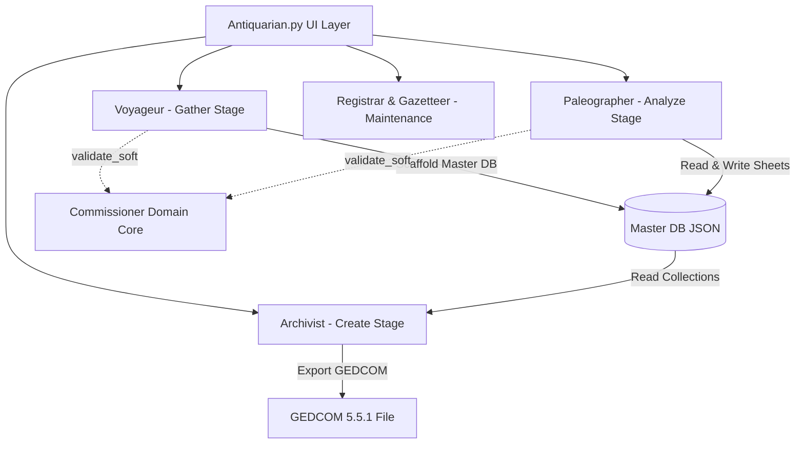

# Architecture Overview

Antiquarian is structured as a pipeline with four primary operational stages and a centralized domain-validation core.

> This page is a module-by-module map of what lives where. For the cross-cutting
> runtime contracts - `.env` precedence, the frozen-build `PROGRAM_DIR`/`APP_DIR`
> distinction, the `runpy` self-relaunch router, `.pmt` search tiers, and the
> Voyageur-gathers/Archivist-decodes split - see `ARCHITECTURE.md` at the repo root.

---

## High-Level System Architecture

---

## Core Subsystems

### 1. Application Layer & Packaging
- Shipped as a single-binary PyInstaller router configured via a dual-mode Inno Setup installer.
- The UI layer is built using CustomTkinter, acting as the main dispatcher.
- Manages tabbed navigation across Voyageur, Paleographer, Archivist, Registrar, Gazetteer, PDFix, and Global Settings.
- Loads `.env` configuration and manages background thread pools for non-blocking downloads and extraction processing.
- Automated release builds are governed by a GitHub Actions CI/CD sandbox.

### 2. Gather Stage (`Voyageur/`)
- Extracts index data and downloads archival page images.
- Modules:
  - `LAC.py`: Programmatic multi-worker downloading of Library and Archives Canada microfilm reels and volume bundles.
  - `FS.py`: FamilySearch church register index table processing and citation mapping.
  - `A.py`: Scraped census page processing and image staging. Includes Tampermonkey script integration (`Voyageur.js`) to capture web index tables.
  - `census_schema.py`: Census record normalization and household grouping heuristics.

### 3. Analyze Stage (`Paleographer/`)
- Transcribes document images into structured JSON records using an advanced pattern recognition and text extraction engine.
- Modules:
  - `Paleographer.py`: Main engine managing single-sheet live extraction, batch jobs, prompt execution, and Master DB merging.
  - `prompts/`: `.pmt` files (`Parish.pmt`, `Scrip.pmt`, `Census.pmt`) specifying document types, roles, extra fields, and extraction engine instructions.

### 4. Create Stage (`Archivist/`)
- Generates GEDCOM 5.5.1 family tree files from Master DB JSON data.
- Modules:
  - `Archivist.py`: Household reconstruction, GEDCOM tag generation, citation linking, and ambiguity note formatting.

### 5. Domain Validation Kernel (`Commissioner/`)
- Pydantic v2 domain models and schema validation registry.
- Modules:
  - `models.py`: Core domain classes (`Collection`, `Sheet`, `Record`, `Participant`, `Fact`, `Citation`).
  - `record_registry.py`: Dynamic `.pmt` scanner, document type schemas, and `validate_soft()` non-raising helper.
  - `normalization.py`: Shared string cleaning, date parsing, and role normalization utilities.

### 6. Maintenance & Utilities
- `Registrar/`: Scans RootsMagic `.rmtree` SQLite databases for duplicate individuals.
- `Gazetteer/`: Historical place name normalization using Newberry Atlas shapefiles.
- `PDFix/`: PDF repair and image extraction helper.
